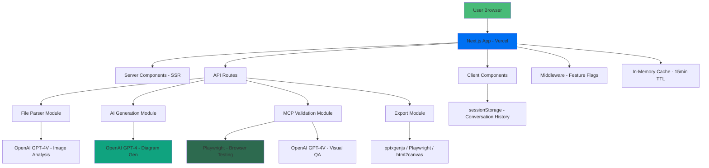
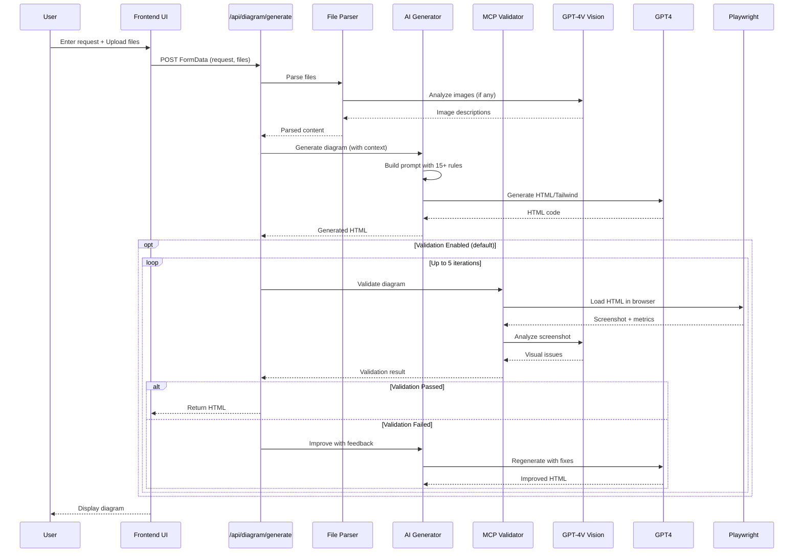

# AI Diagram & Illustration Generator - Technical Design Document

**Project**: AI-Powered Diagram & Illustration Generator
**Version**: 1.0.0
**Date**: January 2025
**Status**: Design Phase
**Based On**: [DIAGRAM-GENERATOR-REQUIREMENTS.md](../00-PROJECT/DIAGRAM-GENERATOR-REQUIREMENTS.md)

---

## Table of Contents

1. [System Architecture](#1-system-architecture)
2. [API Endpoints](#2-api-endpoints)
3. [Frontend Components](#3-frontend-components)
4. [Core Modules](#4-core-modules)
5. [Data Models & TypeScript Types](#5-data-models--typescript-types)
6. [State Management](#6-state-management)
7. [Error Handling Strategy](#7-error-handling-strategy)
8. [Security Considerations](#8-security-considerations)
9. [Performance Optimizations](#9-performance-optimizations)
10. [Testing Strategy](#10-testing-strategy)
11. [Implementation Roadmap](#11-implementation-roadmap)

---

## 1. System Architecture

### 1.1 High-Level Architecture



### 1.2 Data Flow: Complete Generation Pipeline



### 1.3 Stateless Architecture Pattern

**CRITICAL**: This application is **completely stateless** - no database, no server sessions, no persistent storage.

#### Storage Locations:

| Data Type | Storage Location | Lifetime | Max Size |
|-----------|-----------------|----------|----------|
| Conversation history | `sessionStorage` | Until browser close | 10MB |
| Generated diagrams | `sessionStorage` | Until browser close | 5MB per diagram |
| File uploads | RAM (during request) | Request duration | 50MB total |
| OpenAI responses | In-memory cache | 15 minutes | 100 responses |
| Validation screenshots | Temporary (not saved) | Request duration | N/A |

#### State Management Principles:

1. **No Server State**: Each API request is independent
2. **No User Sessions**: No authentication means no session tracking
3. **Browser-Side Persistence**: All history stored client-side
4. **Idempotent Operations**: Same input = same output
5. **No Shared State**: Concurrent requests don't interfere

```typescript
// Example: Browser-side state management
interface SessionState {
  conversations: Array<{
    id: string;
    messages: Message[];
    diagrams: GeneratedDiagram[];
    timestamp: number;
  }>;
  currentConversation: string | null;
}

// Stored in sessionStorage
sessionStorage.setItem('diagramGenerator', JSON.stringify(state));
```

### 1.4 Feature Flag Integration

Uses existing feature flag system (`lib/config/features.ts`):

```typescript
// Feature flags for this application
export const FEATURES = {
  // Muted features (preserved but disabled)
  DATABASE: false,        // No database queries
  AUTH: false,           // No authentication
  STRIPE: false,         // No billing

  // Active features
  DIAGRAM_GENERATOR: true,           // Main feature
  FILE_PARSING: true,                // All file parsers
  MCP_VALIDATION: true,              // Automated validation
  AI_GENERATION: true,               // OpenAI integration
} as const;
```

---

## 2. API Endpoints

### 2.1 POST /api/diagram/generate

**Purpose**: Generate HTML/Tailwind diagrams from user requests and files

#### Request Schema

```typescript
// Content-Type: multipart/form-data

interface GenerateRequest {
  // Required
  userRequest: string;              // Min 10 chars

  // Optional
  file?: File[];                    // Multiple files supported
  conversationHistory?: string;     // JSON string
  previousDiagrams?: string;        // JSON string
  enableValidation?: boolean;       // Default: true
  maxIterations?: number;           // Default: 5, Range: 1-10
}
```

#### Request Example

```typescript
const formData = new FormData();
formData.append('userRequest', 'Create a system architecture diagram with 5 microservices');
formData.append('file', pdfFile);
formData.append('file', imageFile);
formData.append('enableValidation', 'true');
formData.append('maxIterations', '5');
formData.append('conversationHistory', JSON.stringify([
  { role: 'user', content: 'Initial request...' },
  { role: 'assistant', content: '<html>...</html>' }
]));

const response = await fetch('/api/diagram/generate', {
  method: 'POST',
  body: formData,
});
```

#### Response Schema

```typescript
interface GenerateResponse {
  success: boolean;
  html?: string;                    // Generated diagram HTML
  error?: string;
  code?: string;                    // Error code
  metadata: {
    model: string;                  // 'gpt-4o' | 'gpt-4-turbo'
    tokensUsed: number;
    generationTime: number;         // milliseconds
    validationPassed: boolean;
    validationErrors?: string[];
    validationWarnings?: string[];
    iterations?: number;            // Number of validation loops
  };
}
```

#### Response Examples

**Success Response**:
```json
{
  "success": true,
  "html": "<!DOCTYPE html>\n<html>...</html>",
  "metadata": {
    "model": "gpt-4o",
    "tokensUsed": 2847,
    "generationTime": 8342,
    "validationPassed": true,
    "iterations": 2
  }
}
```

**Error Response - Validation Failed**:
```json
{
  "success": false,
  "html": "<!DOCTYPE html>\n<html>...</html>",
  "error": "Max iterations (5) reached. Validation feedback: Missing required Lucide script",
  "metadata": {
    "model": "gpt-4o",
    "tokensUsed": 12456,
    "generationTime": 42100,
    "validationPassed": false,
    "validationErrors": [
      "Missing required script: https://unpkg.com/lucide@latest"
    ],
    "iterations": 5
  }
}
```

**Error Response - Invalid Request**:
```json
{
  "success": false,
  "error": "Invalid request data",
  "code": "validation_error",
  "details": [
    {
      "code": "too_small",
      "minimum": 10,
      "path": ["userRequest"],
      "message": "Request must be at least 10 characters"
    }
  ]
}
```

#### Error Codes

| Code | HTTP Status | Description |
|------|-------------|-------------|
| `validation_error` | 400 | Invalid request data |
| `invalid_files` | 400 | File validation failed |
| `parsing_error` | 400/500 | Failed to parse files |
| `missing_api_key` | 500 | OpenAI API key not configured |
| `internal_error` | 500 | Unexpected server error |

#### Rate Limiting

```typescript
// Rate limiting strategy (implemented in middleware)
const RATE_LIMITS = {
  perIP: 20,              // 20 requests per minute per IP
  windowMs: 60000,        // 1 minute window
};
```

---

### 2.2 POST /api/diagram/export

**Purpose**: Export generated diagrams to various formats (PPTX, PDF, PNG, HTML)

#### Request Schema

```typescript
// Content-Type: application/json

interface ExportRequest {
  html: string;                     // Generated diagram HTML
  format: 'pptx' | 'pdf' | 'png' | 'html';
  options?: {
    filename?: string;              // Default: 'diagram-{timestamp}'
    transparentBackground?: boolean; // PNG only, default: false
    quality?: number;               // PNG/PDF, 1-100, default: 90
    slideSize?: '16:9' | '4:3';    // PPTX only, default: '16:9'
  };
}
```

#### Request Example

```typescript
const response = await fetch('/api/diagram/export', {
  method: 'POST',
  headers: { 'Content-Type': 'application/json' },
  body: JSON.stringify({
    html: generatedHtml,
    format: 'pptx',
    options: {
      filename: 'architecture-diagram',
      slideSize: '16:9'
    }
  })
});

// Binary response - download file
const blob = await response.blob();
const url = URL.createObjectURL(blob);
const a = document.createElement('a');
a.href = url;
a.download = 'architecture-diagram.pptx';
a.click();
```

#### Response

- **Content-Type**: `application/vnd.openxmlformats-officedocument.presentationml.presentation` (PPTX)
- **Content-Type**: `application/pdf` (PDF)
- **Content-Type**: `image/png` (PNG)
- **Content-Type**: `text/html` (HTML)
- **Headers**: `Content-Disposition: attachment; filename="diagram-{timestamp}.{ext}"`

#### Error Response

```json
{
  "success": false,
  "error": "Export failed",
  "code": "export_error",
  "details": "Failed to generate PPTX: Invalid HTML structure"
}
```

---

### 2.3 GET /api/diagram/health

**Purpose**: Health check endpoint for monitoring

#### Response

```json
{
  "status": "healthy",
  "features": {
    "diagramGenerator": true,
    "fileParsing": true,
    "mcpValidation": true,
    "aiGeneration": true
  },
  "dependencies": {
    "openai": "configured",
    "playwright": "available"
  }
}
```

---

## 3. Frontend Components

### 3.1 Page Structure: `app/page.tsx`

**Purpose**: Main diagram generator interface (replaces radiology app homepage)

```typescript
// app/page.tsx
'use client';

import { ChatInterface } from '@/components/diagram/ChatInterface';
import { Header } from '@/components/diagram/Header';
import { Footer } from '@/components/diagram/Footer';

export default function DiagramGeneratorPage() {
  return (
    <div className="min-h-screen flex flex-col bg-gray-50">
      <Header />

      <main className="flex-1 container mx-auto px-4 py-8 max-w-7xl">
        <ChatInterface />
      </main>

      <Footer />
    </div>
  );
}
```

### 3.2 Component Hierarchy

```
app/page.tsx
├── Header
│   ├── Logo
│   └── FeatureToggle (dev only)
│
└── ChatInterface
    ├── ConversationView
    │   ├── MessageList
    │   │   ├── UserMessage
    │   │   ├── AssistantMessage
    │   │   └── DiagramMessage
    │   │       └── DiagramPreview
    │   │           ├── IframeRenderer
    │   │           └── ValidationStatus
    │   └── ScrollToBottom
    │
    ├── InputArea
    │   ├── FileUpload
    │   │   ├── DropZone
    │   │   ├── FileList
    │   │   └── FilePreview
    │   ├── TextInput
    │   ├── SendButton
    │   └── LoadingIndicator
    │
    └── DiagramHistory (sidebar)
        ├── HistoryItem
        └── ClearHistory
```

---

### 3.3 Component: `ChatInterface`

**Purpose**: Main orchestrator component managing conversation state

```typescript
// components/diagram/ChatInterface.tsx
'use client';

import { useState, useCallback } from 'react';
import { ConversationView } from './ConversationView';
import { InputArea } from './InputArea';
import { DiagramHistory } from './DiagramHistory';
import { useConversation } from '@/hooks/useConversation';
import { useDiagramGeneration } from '@/hooks/useDiagramGeneration';

export function ChatInterface() {
  const {
    conversations,
    currentConversation,
    addMessage,
    createConversation,
    switchConversation,
  } = useConversation();

  const {
    generate,
    isLoading,
    error,
  } = useDiagramGeneration();

  const handleSubmit = useCallback(async (
    userRequest: string,
    files: File[]
  ) => {
    // Add user message to conversation
    addMessage({
      role: 'user',
      content: userRequest,
      files: files.map(f => ({ name: f.name, size: f.size })),
    });

    // Generate diagram
    const result = await generate({
      userRequest,
      files,
      conversationHistory: currentConversation?.messages || [],
    });

    if (result.success && result.html) {
      // Add assistant response with diagram
      addMessage({
        role: 'assistant',
        content: result.html,
        metadata: result.metadata,
      });
    } else {
      // Add error message
      addMessage({
        role: 'assistant',
        content: `Error: ${result.error}`,
        error: true,
      });
    }
  }, [generate, addMessage, currentConversation]);

  return (
    <div className="flex gap-4 h-[calc(100vh-12rem)]">
      {/* Sidebar - History */}
      <aside className="w-64 hidden lg:block">
        <DiagramHistory
          conversations={conversations}
          currentId={currentConversation?.id}
          onSwitch={switchConversation}
          onCreate={createConversation}
        />
      </aside>

      {/* Main Chat Area */}
      <div className="flex-1 flex flex-col bg-white rounded-lg shadow-sm">
        <ConversationView
          messages={currentConversation?.messages || []}
          isLoading={isLoading}
        />

        <InputArea
          onSubmit={handleSubmit}
          isLoading={isLoading}
          error={error}
        />
      </div>
    </div>
  );
}
```

**Props**: None (manages own state)

**State**:
- `conversations`: All conversations in current session
- `currentConversation`: Active conversation
- `isLoading`: Generation in progress
- `error`: Last error message

---

### 3.4 Component: `FileUpload`

**Purpose**: Drag-and-drop file upload with validation and preview

```typescript
// components/diagram/FileUpload.tsx
'use client';

import { useCallback, useState } from 'react';
import { useDropzone } from 'react-dropzone';
import { validateFile } from '@/lib/parsers';
import { FilePreview } from './FilePreview';

interface FileUploadProps {
  onFilesChange: (files: File[]) => void;
  maxFiles?: number;
  maxSize?: number;
}

export function FileUpload({
  onFilesChange,
  maxFiles = 10,
  maxSize = 20 * 1024 * 1024, // 20MB
}: FileUploadProps) {
  const [files, setFiles] = useState<File[]>([]);
  const [errors, setErrors] = useState<string[]>([]);

  const onDrop = useCallback((acceptedFiles: File[]) => {
    const validationErrors: string[] = [];
    const validFiles: File[] = [];

    // Validate each file
    for (const file of acceptedFiles) {
      const validation = validateFile(file, maxSize);
      if (validation.isValid) {
        validFiles.push(file);
      } else {
        validationErrors.push(`${file.name}: ${validation.error}`);
      }
    }

    // Check total file count
    if (files.length + validFiles.length > maxFiles) {
      validationErrors.push(`Maximum ${maxFiles} files allowed`);
      return;
    }

    setErrors(validationErrors);
    const newFiles = [...files, ...validFiles];
    setFiles(newFiles);
    onFilesChange(newFiles);
  }, [files, maxFiles, maxSize, onFilesChange]);

  const removeFile = (index: number) => {
    const newFiles = files.filter((_, i) => i !== index);
    setFiles(newFiles);
    onFilesChange(newFiles);
  };

  const { getRootProps, getInputProps, isDragActive } = useDropzone({
    onDrop,
    accept: {
      'application/pdf': ['.pdf'],
      'application/vnd.openxmlformats-officedocument.wordprocessingml.document': ['.docx'],
      'application/vnd.openxmlformats-officedocument.presentationml.presentation': ['.pptx'],
      'application/vnd.openxmlformats-officedocument.spreadsheetml.sheet': ['.xlsx'],
      'text/csv': ['.csv'],
      'text/plain': ['.txt'],
      'image/*': ['.png', '.jpg', '.jpeg', '.gif', '.webp'],
    },
  });

  return (
    <div className="space-y-4">
      {/* Drop Zone */}
      <div
        {...getRootProps()}
        className={`
          border-2 border-dashed rounded-lg p-8 text-center cursor-pointer
          transition-colors duration-200
          ${isDragActive
            ? 'border-blue-500 bg-blue-50'
            : 'border-gray-300 hover:border-gray-400'
          }
        `}
      >
        <input {...getInputProps()} />
        <div className="space-y-2">
          <svg
            className="mx-auto h-12 w-12 text-gray-400"
            stroke="currentColor"
            fill="none"
            viewBox="0 0 48 48"
          >
            <path
              d="M28 8H12a4 4 0 00-4 4v20m32-12v8m0 0v8a4 4 0 01-4 4H12a4 4 0 01-4-4v-4m32-4l-3.172-3.172a4 4 0 00-5.656 0L28 28M8 32l9.172-9.172a4 4 0 015.656 0L28 28m0 0l4 4m4-24h8m-4-4v8m-12 4h.02"
              strokeWidth={2}
              strokeLinecap="round"
              strokeLinejoin="round"
            />
          </svg>
          <div className="text-sm text-gray-600">
            {isDragActive ? (
              <p className="font-medium text-blue-600">Drop files here...</p>
            ) : (
              <>
                <p>
                  <span className="font-medium text-blue-600 hover:underline">
                    Click to upload
                  </span>{' '}
                  or drag and drop
                </p>
                <p className="text-xs text-gray-500 mt-1">
                  PDF, DOCX, PPTX, XLSX, CSV, TXT, or images (max {maxSize / 1024 / 1024}MB each)
                </p>
              </>
            )}
          </div>
        </div>
      </div>

      {/* Error Messages */}
      {errors.length > 0 && (
        <div className="rounded-md bg-red-50 p-4">
          <div className="flex">
            <div className="ml-3">
              <h3 className="text-sm font-medium text-red-800">
                Upload errors:
              </h3>
              <ul className="mt-2 text-sm text-red-700 list-disc list-inside">
                {errors.map((error, i) => (
                  <li key={i}>{error}</li>
                ))}
              </ul>
            </div>
          </div>
        </div>
      )}

      {/* File List */}
      {files.length > 0 && (
        <div className="space-y-2">
          <h4 className="text-sm font-medium text-gray-700">
            Uploaded files ({files.length}/{maxFiles})
          </h4>
          <div className="space-y-2">
            {files.map((file, index) => (
              <FilePreview
                key={index}
                file={file}
                onRemove={() => removeFile(index)}
              />
            ))}
          </div>
        </div>
      )}
    </div>
  );
}
```

**Props**:
- `onFilesChange`: Callback when files change
- `maxFiles`: Maximum number of files (default: 10)
- `maxSize`: Maximum size per file in bytes (default: 20MB)

**Features**:
- Drag-and-drop support
- File type validation
- Size validation
- Preview with remove option
- Error display

---

### 3.5 Component: `DiagramPreview`

**Purpose**: Display generated diagram with validation status

```typescript
// components/diagram/DiagramPreview.tsx
'use client';

import { useState, useEffect, useRef } from 'react';
import { ExportPanel } from './ExportPanel';
import { ValidationStatus } from './ValidationStatus';

interface DiagramPreviewProps {
  html: string;
  metadata?: {
    validationPassed: boolean;
    validationErrors?: string[];
    validationWarnings?: string[];
    iterations?: number;
  };
}

export function DiagramPreview({ html, metadata }: DiagramPreviewProps) {
  const iframeRef = useRef<HTMLIFrameElement>(null);
  const [iframeHeight, setIframeHeight] = useState(600);

  // Auto-resize iframe based on content
  useEffect(() => {
    const iframe = iframeRef.current;
    if (!iframe) return;

    const handleLoad = () => {
      try {
        const contentHeight = iframe.contentWindow?.document.body.scrollHeight;
        if (contentHeight) {
          setIframeHeight(Math.min(contentHeight + 20, 2000));
        }
      } catch (error) {
        console.error('Failed to get iframe height:', error);
      }
    };

    iframe.addEventListener('load', handleLoad);
    return () => iframe.removeEventListener('load', handleLoad);
  }, [html]);

  return (
    <div className="space-y-4">
      {/* Validation Status */}
      {metadata && (
        <ValidationStatus
          passed={metadata.validationPassed}
          errors={metadata.validationErrors}
          warnings={metadata.validationWarnings}
          iterations={metadata.iterations}
        />
      )}

      {/* Diagram Display */}
      <div className="relative border border-gray-200 rounded-lg overflow-hidden bg-white">
        <iframe
          ref={iframeRef}
          srcDoc={html}
          title="Generated Diagram"
          className="w-full border-0"
          style={{ height: `${iframeHeight}px` }}
          sandbox="allow-scripts allow-same-origin"
        />
      </div>

      {/* Export Options */}
      <ExportPanel html={html} />
    </div>
  );
}
```

**Props**:
- `html`: Generated diagram HTML
- `metadata`: Validation and generation metadata

**Features**:
- Sandboxed iframe rendering
- Auto-resize based on content
- Validation status indicator
- Export options panel

---

### 3.6 Component: `ExportPanel`

**Purpose**: Export diagram to various formats

```typescript
// components/diagram/ExportPanel.tsx
'use client';

import { useState } from 'react';
import { exportDiagram } from '@/lib/export';
import type { ExportFormat } from '@/lib/export';

interface ExportPanelProps {
  html: string;
}

export function ExportPanel({ html }: ExportPanelProps) {
  const [exporting, setExporting] = useState<ExportFormat | null>(null);

  const handleExport = async (format: ExportFormat) => {
    setExporting(format);

    try {
      await exportDiagram(html, format);
    } catch (error) {
      console.error('Export failed:', error);
      alert(`Export failed: ${error instanceof Error ? error.message : 'Unknown error'}`);
    } finally {
      setExporting(null);
    }
  };

  const handleCopy = async () => {
    try {
      await navigator.clipboard.writeText(html);
      alert('HTML copied to clipboard!');
    } catch (error) {
      console.error('Copy failed:', error);
      alert('Failed to copy to clipboard');
    }
  };

  return (
    <div className="flex flex-wrap gap-2">
      <button
        onClick={() => handleExport('pptx')}
        disabled={exporting !== null}
        className="inline-flex items-center px-4 py-2 border border-gray-300 rounded-md shadow-sm text-sm font-medium text-gray-700 bg-white hover:bg-gray-50 disabled:opacity-50 disabled:cursor-not-allowed"
      >
        {exporting === 'pptx' ? 'Exporting...' : 'Export as PowerPoint'}
      </button>

      <button
        onClick={() => handleExport('pdf')}
        disabled={exporting !== null}
        className="inline-flex items-center px-4 py-2 border border-gray-300 rounded-md shadow-sm text-sm font-medium text-gray-700 bg-white hover:bg-gray-50 disabled:opacity-50 disabled:cursor-not-allowed"
      >
        {exporting === 'pdf' ? 'Exporting...' : 'Export as PDF'}
      </button>

      <button
        onClick={() => handleExport('png')}
        disabled={exporting !== null}
        className="inline-flex items-center px-4 py-2 border border-gray-300 rounded-md shadow-sm text-sm font-medium text-gray-700 bg-white hover:bg-gray-50 disabled:opacity-50 disabled:cursor-not-allowed"
      >
        {exporting === 'png' ? 'Exporting...' : 'Export as PNG'}
      </button>

      <button
        onClick={() => handleExport('html')}
        disabled={exporting !== null}
        className="inline-flex items-center px-4 py-2 border border-gray-300 rounded-md shadow-sm text-sm font-medium text-gray-700 bg-white hover:bg-gray-50 disabled:opacity-50 disabled:cursor-not-allowed"
      >
        {exporting === 'html' ? 'Downloading...' : 'Download HTML'}
      </button>

      <button
        onClick={handleCopy}
        disabled={exporting !== null}
        className="inline-flex items-center px-4 py-2 border border-blue-300 rounded-md shadow-sm text-sm font-medium text-blue-700 bg-blue-50 hover:bg-blue-100 disabled:opacity-50 disabled:cursor-not-allowed"
      >
        Copy HTML to Clipboard
      </button>
    </div>
  );
}
```

**Props**:
- `html`: Diagram HTML to export

**Features**:
- Export to PPTX, PDF, PNG, HTML
- Copy to clipboard
- Loading states
- Error handling

---

## 4. Core Modules

### 4.1 File Parsing Module (`lib/parsers/`)

**Status**: ✅ **Already Implemented**

**Entry Point**: `lib/parsers/index.ts`

```typescript
// Public API
export async function parseFile(file: File): Promise<ParsedFile | ParserError>;
export async function parseMultipleFiles(files: File[]): Promise<Array<ParsedFile | ParserError>>;
export function validateFile(file: File, maxSize?: number): { isValid: boolean; error?: string };
```

**Supported Parsers**:

| Parser | File | Status | Key Dependencies |
|--------|------|--------|------------------|
| Text | `text-parser.ts` | ✅ Implemented | Native |
| PDF | `pdf-parser.ts` | ✅ Implemented | `pdf-parse` |
| Word | `docx-parser.ts` | ✅ Implemented | `mammoth` |
| PowerPoint | `pptx-parser.ts` | ✅ Implemented | `jszip` |
| Excel | `xlsx-parser.ts` | ✅ Implemented | `xlsx` |
| CSV | `csv-parser.ts` | ✅ Implemented | `csv-parse` |
| Images | `image-parser.ts` | ✅ Implemented | OpenAI GPT-4V |

**Interface**:

```typescript
export interface ParsedFile {
  fileName: string;
  fileType: string;
  content: string;              // Extracted text content
  metadata?: Record<string, any>;
  images?: Array<{
    description: string;        // From GPT-4V analysis
    data: string;               // base64 encoded
  }>;
}

export interface ParserError {
  fileName: string;
  error: string;
  details?: string;
}
```

**Error Handling**:

```typescript
// Each parser follows this pattern:
try {
  const arrayBuffer = await file.arrayBuffer();
  const content = await extractContent(arrayBuffer);

  return {
    fileName: file.name,
    fileType: file.type,
    content,
    metadata: { /* ... */ }
  };
} catch (error) {
  return {
    fileName: file.name,
    error: 'Failed to parse file',
    details: error instanceof Error ? error.message : 'Unknown error',
  };
}
```

---

### 4.2 AI Generation Module (`lib/ai/diagram-generator.ts`)

**Status**: ✅ **Already Implemented** (needs completion for MCP integration)

**Public API**:

```typescript
// Core generation function
export async function generateDiagram(
  request: DiagramGenerationRequest
): Promise<DiagramGenerationResult>;

// Improvement based on feedback
export async function improveDiagram(
  originalRequest: string,
  currentHtml: string,
  feedback: string
): Promise<DiagramGenerationResult>;

// Full feedback loop with validation
export async function generateWithFeedbackLoop(
  request: DiagramGenerationRequest,
  maxIterations?: number,
  validateFn?: (html: string) => Promise<{ isValid: boolean; feedback?: string }>
): Promise<DiagramGenerationResult>;

// Convenience wrapper with MCP validation
export async function generateDiagramWithValidation(
  request: DiagramGenerationRequest,
  maxIterations?: number
): Promise<DiagramGenerationResult>;
```

**Interfaces**:

```typescript
export interface DiagramGenerationRequest {
  userRequest: string;
  files?: ParsedFile[];
  conversationHistory?: Array<{ role: string; content: string }>;
  previousDiagrams?: string[];
}

export interface DiagramGenerationResult {
  success: boolean;
  html?: string;
  error?: string;
  metadata: {
    model: string;
    tokensUsed: number;
    generationTime: number;
    validationPassed: boolean;
    validationErrors?: string[];
    validationWarnings?: string[];
    iterations?: number;
  };
}
```

**Prompt Engineering Rules**:

Located in `lib/ai/diagram-prompt-template.ts`:

```typescript
export const DIAGRAM_GENERATION_SYSTEM_PROMPT = `
You are an expert at creating beautiful, professional diagrams...

CRITICAL RULES - FOLLOW EXACTLY:
1. OUTPUT FORMAT: Single HTML code block with inline CSS
2. REQUIRED SCRIPTS: Tailwind CDN + Lucide CDN
3. ICONS: Lucide only, strokeWidth: 1.5
4. DESIGN STYLE: Linear/Stripe/Vercel aesthetic
5. TYPOGRAPHY: One level thinner, tracking-tight for >20px
6. RESPONSIVENESS: Mobile-first, all breakpoints
7. CSS STRUCTURE: Tailwind classes only, no <style> tags
8. VISUAL ELEMENTS: Subtle dividers, soft contrast
9. IMAGES: Unsplash if not provided
10. INTERACTIVITY: CSS animations only, no JS
11. CHARTS: Chart.js with animation: false
12. COLOR MODES: Dark for tech, light for business
13. BUTTONS: No floating DOWNLOAD buttons
14. LAYOUT: Flexbox/grid, proper spacing
15. ACCESSIBILITY: Semantic HTML, ARIA, alt text
`;
```

**Generation Flow**:

```typescript
async function generateDiagram(request: DiagramGenerationRequest): Promise<DiagramGenerationResult> {
  // 1. Validate API key
  if (!process.env.OPENAI_API_KEY) {
    return { success: false, error: 'API key not configured', ... };
  }

  // 2. Build prompt with context
  const messages = buildDiagramPrompt(request.userRequest, {
    fileContents: request.files?.map(f => f.content),
    previousDiagrams: request.previousDiagrams,
    conversationHistory: request.conversationHistory,
  });

  // 3. Call OpenAI API
  const response = await openai.chat.completions.create({
    model: 'gpt-4o',
    messages,
    temperature: 0.7,
    max_tokens: 4000,
  });

  // 4. Extract HTML from response
  const html = extractHtmlFromResponse(response.choices[0].message.content);

  // 5. Basic validation
  const validation = validateGeneratedHtml(html);

  return {
    success: validation.isValid,
    html,
    error: validation.errors.join(', '),
    metadata: { ... },
  };
}
```

**Feedback Loop Implementation**:

```typescript
async function generateWithFeedbackLoop(
  request: DiagramGenerationRequest,
  maxIterations: number = 5,
  validateFn?: (html: string) => Promise<{ isValid: boolean; feedback?: string }>
): Promise<DiagramGenerationResult> {
  let iterations = 0;

  // Initial generation
  let result = await generateDiagram(request);
  iterations++;

  if (!result.success || !result.html) {
    return result;
  }

  // Validation feedback loop
  if (validateFn) {
    let currentHtml = result.html;

    while (iterations < maxIterations) {
      const validation = await validateFn(currentHtml);

      if (validation.isValid) {
        return { success: true, html: currentHtml, metadata: { iterations, ... } };
      }

      // Improve based on feedback
      const improved = await improveDiagram(
        request.userRequest,
        currentHtml,
        validation.feedback || 'Please improve'
      );

      iterations++;

      if (!improved.success || !improved.html) {
        return { success: false, error: 'Failed to improve', iterations, ... };
      }

      currentHtml = improved.html;
    }

    return {
      success: false,
      html: currentHtml,
      error: `Max iterations (${maxIterations}) reached`,
      metadata: { iterations, ... }
    };
  }

  return result;
}
```

---

### 4.3 MCP Validation Module (`lib/validation/mcp-playwright.ts`)

**Status**: ✅ **Already Implemented** (needs testing)

**Public API**:

```typescript
export async function validateDiagram(
  html: string,
  originalRequest: string
): Promise<ValidationResult>;
```

**Interface**:

```typescript
export interface ValidationResult {
  isValid: boolean;
  feedback?: string;
  issues: Array<{
    type: 'error' | 'warning';
    category: string;
    message: string;
  }>;
  screenshot?: string;          // base64 encoded
  metadata: {
    validationTime: number;
    checksPerformed: string[];
  };
}
```

**Validation Pipeline**:

```typescript
async function validateDiagram(html: string, originalRequest: string): Promise<ValidationResult> {
  const issues: ValidationResult['issues'] = [];
  const checksPerformed: string[] = [];

  // 1. Structural validation (no browser)
  const structuralIssues = validateStructure(html);
  issues.push(...structuralIssues);
  checksPerformed.push('structural');

  // 2. Browser-based validation
  const browser = await chromium.launch({ headless: true });
  const page = await browser.newPage({ viewport: { width: 1280, height: 720 } });

  // Load HTML
  await page.setContent(html);
  await page.waitForTimeout(1000);

  // Initialize Lucide
  await page.evaluate(() => {
    if (typeof (window as any).lucide !== 'undefined') {
      (window as any).lucide.createIcons();
    }
  });

  // Take screenshot
  const screenshot = await page.screenshot({ fullPage: true, type: 'png' });
  checksPerformed.push('screenshot');

  // Check console errors
  const consoleErrors: string[] = [];
  page.on('console', msg => {
    if (msg.type() === 'error') consoleErrors.push(msg.text());
  });
  checksPerformed.push('console-errors');

  // Check responsive design
  const responsiveIssues = await checkResponsive(page);
  issues.push(...responsiveIssues);
  checksPerformed.push('responsive');

  // Check accessibility
  const a11yIssues = await checkAccessibility(page);
  issues.push(...a11yIssues);
  checksPerformed.push('accessibility');

  await browser.close();

  // 3. Visual validation with GPT-4V
  if (screenshot) {
    const visualIssues = await validateVisually(
      screenshot.toString('base64'),
      originalRequest
    );
    issues.push(...visualIssues);
    checksPerformed.push('visual-validation');
  }

  // Determine pass/fail
  const hasErrors = issues.some(issue => issue.type === 'error');
  const isValid = !hasErrors;

  return {
    isValid,
    feedback: isValid ? undefined : buildFeedbackMessage(issues, originalRequest),
    issues,
    screenshot: screenshot?.toString('base64'),
    metadata: {
      validationTime: Date.now() - startTime,
      checksPerformed,
    },
  };
}
```

**Structural Validation**:

```typescript
function validateStructure(html: string): ValidationResult['issues'] {
  const issues: ValidationResult['issues'] = [];

  // Check required scripts
  if (!html.includes('cdn.tailwindcss.com')) {
    issues.push({
      type: 'error',
      category: 'structure',
      message: 'Missing required script: Tailwind CSS CDN',
    });
  }

  if (!html.includes('unpkg.com/lucide')) {
    issues.push({
      type: 'error',
      category: 'structure',
      message: 'Missing required script: Lucide icons',
    });
  }

  // Check required HTML structure
  for (const tag of ['html', 'head', 'body']) {
    if (!html.includes(`<${tag}`)) {
      issues.push({
        type: 'error',
        category: 'structure',
        message: `Missing required HTML tag: <${tag}>`,
      });
    }
  }

  // Check for forbidden elements
  if (html.includes('<style>') || html.includes('<style ')) {
    issues.push({
      type: 'error',
      category: 'structure',
      message: 'Contains forbidden <style> tag - use inline styles only',
    });
  }

  return issues;
}
```

**Responsive Design Validation**:

```typescript
async function checkResponsive(page: any): Promise<ValidationResult['issues']> {
  const issues: ValidationResult['issues'] = [];

  const viewports = [
    { name: 'mobile', width: 375, height: 667 },
    { name: 'tablet', width: 768, height: 1024 },
    { name: 'desktop', width: 1280, height: 720 },
  ];

  for (const viewport of viewports) {
    await page.setViewportSize(viewport);
    await page.waitForTimeout(300);

    const hasOverflow = await page.evaluate(() => {
      return document.body.scrollWidth > document.body.clientWidth;
    });

    if (hasOverflow) {
      issues.push({
        type: 'warning',
        category: 'responsive',
        message: `Horizontal overflow on ${viewport.name} (${viewport.width}x${viewport.height})`,
      });
    }
  }

  return issues;
}
```

**Visual Validation with GPT-4V**:

```typescript
async function validateVisually(
  screenshot: string,
  originalRequest: string
): Promise<ValidationResult['issues']> {
  const issues: ValidationResult['issues'] = [];

  const response = await openai.chat.completions.create({
    model: 'gpt-4o',
    messages: [
      {
        role: 'user',
        content: [
          {
            type: 'text',
            text: `Analyze this diagram screenshot. Original request: "${originalRequest}"\n\n` +
                  `Check for:\n1. Matches user request?\n2. Professional design?\n` +
                  `3. Appropriate colors/contrast?\n4. Readable text?\n5. Visual bugs?\n6. Good layout?\n\n` +
                  `Respond with JSON: { "isValid": boolean, "issues": string[] }`,
          },
          {
            type: 'image_url',
            image_url: { url: `data:image/png;base64,${screenshot}` },
          },
        ],
      },
    ],
    max_tokens: 500,
  });

  const result = JSON.parse(response.choices[0].message.content);

  if (result.issues && Array.isArray(result.issues)) {
    for (const issue of result.issues) {
      issues.push({
        type: result.isValid ? 'warning' : 'error',
        category: 'visual',
        message: issue,
      });
    }
  }

  return issues;
}
```

---

### 4.4 Export Module (`lib/export/`)

**Status**: ❌ **Not Yet Implemented**

**Public API**:

```typescript
// lib/export/index.ts
export type ExportFormat = 'pptx' | 'pdf' | 'png' | 'html';

export async function exportDiagram(
  html: string,
  format: ExportFormat,
  options?: ExportOptions
): Promise<void>;

export interface ExportOptions {
  filename?: string;
  transparentBackground?: boolean;  // PNG only
  quality?: number;                 // PNG/PDF (1-100)
  slideSize?: '16:9' | '4:3';      // PPTX only
}
```

**Implementation Files**:

| File | Purpose | Dependencies |
|------|---------|--------------|
| `lib/export/pptx-exporter.ts` | PowerPoint export | `pptxgenjs` |
| `lib/export/pdf-exporter.ts` | PDF export | `playwright-core` |
| `lib/export/png-exporter.ts` | PNG export | `html2canvas` or Playwright |
| `lib/export/html-exporter.ts` | HTML download | Native |

**PPTX Export Implementation**:

```typescript
// lib/export/pptx-exporter.ts
import pptxgen from 'pptxgenjs';

export async function exportToPPTX(
  html: string,
  options?: {
    filename?: string;
    slideSize?: '16:9' | '4:3';
  }
): Promise<void> {
  const pptx = new pptxgen();

  // Configure slide size
  if (options?.slideSize === '4:3') {
    pptx.layout = 'LAYOUT_4x3';
  } else {
    pptx.layout = 'LAYOUT_16x9';
  }

  // Add slide
  const slide = pptx.addSlide();

  // Render HTML to image using Playwright
  const imageData = await renderHtmlToImage(html);

  // Add image to slide
  slide.addImage({
    data: imageData,
    x: 0,
    y: 0,
    w: '100%',
    h: '100%',
    sizing: { type: 'contain', w: '100%', h: '100%' },
  });

  // Download
  const filename = options?.filename || `diagram-${Date.now()}`;
  await pptx.writeFile({ fileName: `${filename}.pptx` });
}

// Helper: Render HTML to high-res image
async function renderHtmlToImage(html: string): Promise<string> {
  const { chromium } = await import('playwright-core');
  const browser = await chromium.launch();
  const page = await browser.newPage({
    viewport: { width: 1920, height: 1080 },
    deviceScaleFactor: 2,  // Retina quality
  });

  await page.setContent(html);
  await page.waitForTimeout(1000);

  // Initialize Lucide if present
  await page.evaluate(() => {
    if (typeof (window as any).lucide !== 'undefined') {
      (window as any).lucide.createIcons();
    }
  });

  const screenshot = await page.screenshot({
    fullPage: true,
    type: 'png',
  });

  await browser.close();

  return `data:image/png;base64,${screenshot.toString('base64')}`;
}
```

**PDF Export Implementation**:

```typescript
// lib/export/pdf-exporter.ts
import { chromium } from 'playwright-core';

export async function exportToPDF(
  html: string,
  options?: {
    filename?: string;
    quality?: number;
  }
): Promise<void> {
  const browser = await chromium.launch();
  const page = await browser.newPage({
    viewport: { width: 1920, height: 1080 },
  });

  await page.setContent(html);
  await page.waitForTimeout(1000);

  // Initialize Lucide
  await page.evaluate(() => {
    if (typeof (window as any).lucide !== 'undefined') {
      (window as any).lucide.createIcons();
    }
  });

  // Generate PDF
  const pdf = await page.pdf({
    format: 'A4',
    printBackground: true,
    margin: { top: '0', right: '0', bottom: '0', left: '0' },
  });

  await browser.close();

  // Trigger download
  const filename = options?.filename || `diagram-${Date.now()}`;
  const blob = new Blob([pdf], { type: 'application/pdf' });
  const url = URL.createObjectURL(blob);
  const a = document.createElement('a');
  a.href = url;
  a.download = `${filename}.pdf`;
  a.click();
  URL.revokeObjectURL(url);
}
```

**PNG Export Implementation**:

```typescript
// lib/export/png-exporter.ts
import html2canvas from 'html2canvas';

export async function exportToPNG(
  html: string,
  options?: {
    filename?: string;
    transparentBackground?: boolean;
    quality?: number;
  }
): Promise<void> {
  // Create temporary container
  const container = document.createElement('div');
  container.style.position = 'absolute';
  container.style.left = '-9999px';
  container.innerHTML = html;
  document.body.appendChild(container);

  // Wait for scripts to load
  await new Promise(resolve => setTimeout(resolve, 1000));

  // Initialize Lucide
  if (typeof (window as any).lucide !== 'undefined') {
    (window as any).lucide.createIcons();
  }

  // Capture to canvas
  const canvas = await html2canvas(container, {
    backgroundColor: options?.transparentBackground ? null : '#ffffff',
    scale: 2,  // Retina quality
    logging: false,
  });

  // Remove container
  document.body.removeChild(container);

  // Convert to blob and download
  canvas.toBlob(
    (blob) => {
      if (!blob) return;

      const url = URL.createObjectURL(blob);
      const a = document.createElement('a');
      const filename = options?.filename || `diagram-${Date.now()}`;
      a.href = url;
      a.download = `${filename}.png`;
      a.click();
      URL.revokeObjectURL(url);
    },
    'image/png',
    (options?.quality || 90) / 100
  );
}
```

**HTML Export Implementation**:

```typescript
// lib/export/html-exporter.ts
export function exportToHTML(
  html: string,
  options?: {
    filename?: string;
  }
): void {
  // Ensure self-contained HTML
  const selfContainedHtml = ensureSelfContained(html);

  // Create blob and download
  const blob = new Blob([selfContainedHtml], { type: 'text/html;charset=utf-8' });
  const url = URL.createObjectURL(blob);
  const a = document.createElement('a');
  const filename = options?.filename || `diagram-${Date.now()}`;
  a.href = url;
  a.download = `${filename}.html`;
  a.click();
  URL.revokeObjectURL(url);
}

function ensureSelfContained(html: string): string {
  // Add attribution comment
  const attribution = `
<!--
  Generated by AI Diagram & Illustration Generator
  Created: ${new Date().toISOString()}

  This is a self-contained HTML file with embedded styles.
  Open directly in any modern browser.
-->
`;

  return html.replace('<html>', `<html>\n${attribution}`);
}
```

---

## 5. Data Models & TypeScript Types

### 5.1 Core Types

```typescript
// types/diagram.ts

/**
 * User's request to generate a diagram
 */
export interface DiagramGenerationRequest {
  userRequest: string;
  files?: ParsedFile[];
  conversationHistory?: ConversationMessage[];
  previousDiagrams?: string[];
  enableValidation?: boolean;
  maxIterations?: number;
}

/**
 * Result of diagram generation
 */
export interface DiagramGenerationResult {
  success: boolean;
  html?: string;
  error?: string;
  metadata: DiagramMetadata;
}

/**
 * Metadata about diagram generation
 */
export interface DiagramMetadata {
  model: string;
  tokensUsed: number;
  generationTime: number;
  validationPassed: boolean;
  validationErrors?: string[];
  validationWarnings?: string[];
  iterations?: number;
  timestamp?: string;
}

/**
 * Message in conversation
 */
export interface ConversationMessage {
  id: string;
  role: 'user' | 'assistant';
  content: string;
  timestamp: number;
  files?: FileReference[];
  metadata?: DiagramMetadata;
  error?: boolean;
}

/**
 * Reference to an uploaded file
 */
export interface FileReference {
  name: string;
  size: number;
  type: string;
}

/**
 * Complete conversation
 */
export interface Conversation {
  id: string;
  title: string;
  messages: ConversationMessage[];
  createdAt: number;
  updatedAt: number;
}
```

### 5.2 Parser Types

```typescript
// types/parser.ts

/**
 * Successfully parsed file
 */
export interface ParsedFile {
  fileName: string;
  fileType: string;
  content: string;
  metadata?: FileMetadata;
  images?: ParsedImage[];
}

/**
 * File parsing error
 */
export interface ParserError {
  fileName: string;
  error: string;
  details?: string;
}

/**
 * File metadata (varies by type)
 */
export interface FileMetadata {
  pages?: number;              // PDF
  slides?: number;             // PPTX
  sheets?: string[];           // XLSX
  rows?: number;               // CSV
  author?: string;
  createdAt?: string;
  modifiedAt?: string;
}

/**
 * Parsed image with AI analysis
 */
export interface ParsedImage {
  description: string;         // GPT-4V analysis
  data: string;                // base64 encoded
  width?: number;
  height?: number;
  format?: string;
}
```

### 5.3 Validation Types

```typescript
// types/validation.ts

/**
 * Result of diagram validation
 */
export interface ValidationResult {
  isValid: boolean;
  feedback?: string;
  issues: ValidationIssue[];
  screenshot?: string;
  metadata: ValidationMetadata;
}

/**
 * Individual validation issue
 */
export interface ValidationIssue {
  type: 'error' | 'warning';
  category: ValidationCategory;
  message: string;
  severity?: 'critical' | 'high' | 'medium' | 'low';
}

/**
 * Validation category
 */
export type ValidationCategory =
  | 'structure'
  | 'javascript'
  | 'responsive'
  | 'accessibility'
  | 'visual'
  | 'performance'
  | 'browser';

/**
 * Validation metadata
 */
export interface ValidationMetadata {
  validationTime: number;
  checksPerformed: string[];
  viewportsTested?: string[];
  browserVersion?: string;
}
```

### 5.4 Export Types

```typescript
// types/export.ts

/**
 * Export format
 */
export type ExportFormat = 'pptx' | 'pdf' | 'png' | 'html';

/**
 * Export options
 */
export interface ExportOptions {
  filename?: string;
  transparentBackground?: boolean;  // PNG only
  quality?: number;                 // PNG/PDF (1-100)
  slideSize?: '16:9' | '4:3';      // PPTX only
}

/**
 * Export result
 */
export interface ExportResult {
  success: boolean;
  error?: string;
  metadata?: {
    format: ExportFormat;
    fileSize?: number;
    exportTime: number;
  };
}
```

### 5.5 State Types

```typescript
// types/state.ts

/**
 * Application state (stored in sessionStorage)
 */
export interface SessionState {
  conversations: Conversation[];
  currentConversationId: string | null;
  settings: UserSettings;
  version: string;
}

/**
 * User settings (persisted across sessions in localStorage)
 */
export interface UserSettings {
  enableValidation: boolean;
  maxIterations: number;
  defaultExportFormat: ExportFormat;
  theme: 'light' | 'dark' | 'auto';
}

/**
 * UI state (ephemeral, component-level)
 */
export interface UIState {
  isGenerating: boolean;
  isExporting: boolean;
  currentError: string | null;
  uploadedFiles: File[];
  selectedDiagram: string | null;
}
```

---

## 6. State Management

### 6.1 State Management Strategy

**Philosophy**: Stateless architecture with browser-side persistence

**Storage Layers**:

| Layer | Technology | Lifetime | Use Case |
|-------|-----------|----------|----------|
| Session | `sessionStorage` | Browser session | Conversation history, diagrams |
| Persistent | `localStorage` | Permanent | User preferences, settings |
| Ephemeral | React state | Component lifetime | UI state, loading states |
| Cache | In-memory | 15 minutes | OpenAI responses, parsed files |

### 6.2 Session Storage Schema

```typescript
// lib/storage/session-storage.ts

const SESSION_STORAGE_KEY = 'diagramGenerator';
const VERSION = '1.0.0';

export interface StoredState {
  version: string;
  conversations: Conversation[];
  currentConversationId: string | null;
  timestamp: number;
}

/**
 * Save state to sessionStorage
 */
export function saveSessionState(state: StoredState): void {
  try {
    const serialized = JSON.stringify({
      ...state,
      version: VERSION,
      timestamp: Date.now(),
    });

    sessionStorage.setItem(SESSION_STORAGE_KEY, serialized);
  } catch (error) {
    console.error('Failed to save session state:', error);

    // Handle quota exceeded
    if (error instanceof DOMException && error.name === 'QuotaExceededError') {
      // Remove oldest conversation
      const newState = {
        ...state,
        conversations: state.conversations.slice(1),
      };
      saveSessionState(newState);
    }
  }
}

/**
 * Load state from sessionStorage
 */
export function loadSessionState(): StoredState | null {
  try {
    const serialized = sessionStorage.getItem(SESSION_STORAGE_KEY);
    if (!serialized) return null;

    const state = JSON.parse(serialized) as StoredState;

    // Version check
    if (state.version !== VERSION) {
      console.warn('Session state version mismatch, clearing');
      clearSessionState();
      return null;
    }

    return state;
  } catch (error) {
    console.error('Failed to load session state:', error);
    return null;
  }
}

/**
 * Clear session state
 */
export function clearSessionState(): void {
  sessionStorage.removeItem(SESSION_STORAGE_KEY);
}
```

### 6.3 React Hooks for State Management

```typescript
// hooks/useConversation.ts

import { useState, useEffect, useCallback } from 'react';
import { loadSessionState, saveSessionState } from '@/lib/storage/session-storage';
import type { Conversation, ConversationMessage } from '@/types/diagram';

export function useConversation() {
  const [conversations, setConversations] = useState<Conversation[]>([]);
  const [currentConversationId, setCurrentConversationId] = useState<string | null>(null);

  // Load from sessionStorage on mount
  useEffect(() => {
    const state = loadSessionState();
    if (state) {
      setConversations(state.conversations);
      setCurrentConversationId(state.currentConversationId);
    } else {
      // Create initial conversation
      const newConversation = createNewConversation();
      setConversations([newConversation]);
      setCurrentConversationId(newConversation.id);
    }
  }, []);

  // Save to sessionStorage on state change
  useEffect(() => {
    if (conversations.length > 0) {
      saveSessionState({
        version: '1.0.0',
        conversations,
        currentConversationId,
        timestamp: Date.now(),
      });
    }
  }, [conversations, currentConversationId]);

  const currentConversation = conversations.find(c => c.id === currentConversationId);

  const createConversation = useCallback(() => {
    const newConversation = createNewConversation();
    setConversations(prev => [...prev, newConversation]);
    setCurrentConversationId(newConversation.id);
    return newConversation;
  }, []);

  const addMessage = useCallback((message: Omit<ConversationMessage, 'id' | 'timestamp'>) => {
    const newMessage: ConversationMessage = {
      ...message,
      id: generateId(),
      timestamp: Date.now(),
    };

    setConversations(prev =>
      prev.map(conv =>
        conv.id === currentConversationId
          ? {
              ...conv,
              messages: [...conv.messages, newMessage],
              updatedAt: Date.now(),
            }
          : conv
      )
    );
  }, [currentConversationId]);

  const switchConversation = useCallback((id: string) => {
    setCurrentConversationId(id);
  }, []);

  const deleteConversation = useCallback((id: string) => {
    setConversations(prev => prev.filter(c => c.id !== id));
    if (id === currentConversationId) {
      setCurrentConversationId(conversations[0]?.id || null);
    }
  }, [currentConversationId, conversations]);

  return {
    conversations,
    currentConversation,
    createConversation,
    addMessage,
    switchConversation,
    deleteConversation,
  };
}

function createNewConversation(): Conversation {
  return {
    id: generateId(),
    title: 'New Conversation',
    messages: [],
    createdAt: Date.now(),
    updatedAt: Date.now(),
  };
}

function generateId(): string {
  return `${Date.now()}-${Math.random().toString(36).substr(2, 9)}`;
}
```

```typescript
// hooks/useDiagramGeneration.ts

import { useState, useCallback } from 'react';
import type { DiagramGenerationRequest, DiagramGenerationResult } from '@/types/diagram';

export function useDiagramGeneration() {
  const [isLoading, setIsLoading] = useState(false);
  const [error, setError] = useState<string | null>(null);

  const generate = useCallback(async (
    request: DiagramGenerationRequest
  ): Promise<DiagramGenerationResult> => {
    setIsLoading(true);
    setError(null);

    try {
      // Build FormData
      const formData = new FormData();
      formData.append('userRequest', request.userRequest);

      if (request.files) {
        for (const file of request.files) {
          formData.append('file', file as any);
        }
      }

      if (request.conversationHistory) {
        formData.append('conversationHistory', JSON.stringify(request.conversationHistory));
      }

      if (request.previousDiagrams) {
        formData.append('previousDiagrams', JSON.stringify(request.previousDiagrams));
      }

      formData.append('enableValidation', String(request.enableValidation ?? true));
      formData.append('maxIterations', String(request.maxIterations ?? 5));

      // Call API
      const response = await fetch('/api/diagram/generate', {
        method: 'POST',
        body: formData,
      });

      const result: DiagramGenerationResult = await response.json();

      if (!result.success) {
        setError(result.error || 'Generation failed');
      }

      return result;
    } catch (err) {
      const errorMessage = err instanceof Error ? err.message : 'Unknown error';
      setError(errorMessage);

      return {
        success: false,
        error: errorMessage,
        metadata: {
          model: 'none',
          tokensUsed: 0,
          generationTime: 0,
          validationPassed: false,
        },
      };
    } finally {
      setIsLoading(false);
    }
  }, []);

  return {
    generate,
    isLoading,
    error,
  };
}
```

### 6.4 Local Storage for Settings

```typescript
// lib/storage/settings-storage.ts

import type { UserSettings } from '@/types/state';

const SETTINGS_KEY = 'diagramGeneratorSettings';

const DEFAULT_SETTINGS: UserSettings = {
  enableValidation: true,
  maxIterations: 5,
  defaultExportFormat: 'png',
  theme: 'auto',
};

export function loadSettings(): UserSettings {
  try {
    const stored = localStorage.getItem(SETTINGS_KEY);
    if (!stored) return DEFAULT_SETTINGS;

    return { ...DEFAULT_SETTINGS, ...JSON.parse(stored) };
  } catch {
    return DEFAULT_SETTINGS;
  }
}

export function saveSettings(settings: UserSettings): void {
  try {
    localStorage.setItem(SETTINGS_KEY, JSON.stringify(settings));
  } catch (error) {
    console.error('Failed to save settings:', error);
  }
}
```

### 6.5 In-Memory Cache

```typescript
// lib/cache/memory-cache.ts

interface CacheEntry<T> {
  data: T;
  timestamp: number;
  expiresAt: number;
}

/**
 * Simple in-memory cache with TTL
 */
export class MemoryCache<T = any> {
  private cache = new Map<string, CacheEntry<T>>();
  private defaultTTL: number;

  constructor(defaultTTL: number = 15 * 60 * 1000) { // 15 minutes
    this.defaultTTL = defaultTTL;
  }

  set(key: string, data: T, ttl?: number): void {
    const now = Date.now();
    this.cache.set(key, {
      data,
      timestamp: now,
      expiresAt: now + (ttl || this.defaultTTL),
    });
  }

  get(key: string): T | null {
    const entry = this.cache.get(key);
    if (!entry) return null;

    // Check expiration
    if (Date.now() > entry.expiresAt) {
      this.cache.delete(key);
      return null;
    }

    return entry.data;
  }

  has(key: string): boolean {
    return this.get(key) !== null;
  }

  delete(key: string): void {
    this.cache.delete(key);
  }

  clear(): void {
    this.cache.clear();
  }

  // Clean up expired entries
  cleanup(): void {
    const now = Date.now();
    for (const [key, entry] of this.cache.entries()) {
      if (now > entry.expiresAt) {
        this.cache.delete(key);
      }
    }
  }
}

// Global cache instance
export const responseCache = new MemoryCache();

// Auto cleanup every 5 minutes
setInterval(() => {
  responseCache.cleanup();
}, 5 * 60 * 1000);
```

---

## 7. Error Handling Strategy

### 7.1 Error Categories

| Category | Description | User Impact | Recovery Strategy |
|----------|-------------|-------------|-------------------|
| Validation Errors | Invalid input data | Show form errors | Guide user to fix input |
| Parsing Errors | File parsing failed | Show file-specific error | Allow retry or remove file |
| API Errors | OpenAI API failure | Show generation error | Retry with exponential backoff |
| Network Errors | Network connectivity | Show connection error | Retry button |
| Rate Limit Errors | Too many requests | Show rate limit message | Wait and retry |
| Timeout Errors | Request took too long | Show timeout message | Retry or cancel |
| Export Errors | Export failed | Show export error | Retry or try different format |
| Browser Errors | Feature not supported | Show compatibility message | Suggest alternative browser |

### 7.2 Error Response Format

```typescript
// types/error.ts

export interface ApiError {
  success: false;
  error: string;
  code: ErrorCode;
  details?: any;
  recoverable?: boolean;
  retryAfter?: number;
}

export type ErrorCode =
  | 'validation_error'
  | 'parsing_error'
  | 'api_error'
  | 'rate_limit'
  | 'timeout'
  | 'network_error'
  | 'export_error'
  | 'browser_error'
  | 'internal_error';

export interface ErrorMetadata {
  timestamp: number;
  requestId?: string;
  userAgent?: string;
}
```

### 7.3 Error Handling Utilities

```typescript
// lib/errors/error-handler.ts

import type { ApiError, ErrorCode } from '@/types/error';

/**
 * Create standardized error response
 */
export function createErrorResponse(
  message: string,
  code: ErrorCode,
  details?: any,
  recoverable: boolean = true
): ApiError {
  return {
    success: false,
    error: message,
    code,
    details,
    recoverable,
  };
}

/**
 * Handle OpenAI API errors
 */
export function handleOpenAIError(error: any): ApiError {
  // Rate limit error
  if (error.status === 429) {
    const retryAfter = parseInt(error.headers?.['retry-after'] || '60');
    return {
      success: false,
      error: 'Rate limit exceeded. Please wait before trying again.',
      code: 'rate_limit',
      retryAfter,
      recoverable: true,
    };
  }

  // Timeout
  if (error.code === 'ETIMEDOUT' || error.status === 408) {
    return createErrorResponse(
      'Request timed out. Please try again.',
      'timeout'
    );
  }

  // Invalid API key
  if (error.status === 401) {
    return {
      success: false,
      error: 'API authentication failed.',
      code: 'api_error',
      recoverable: false,
    };
  }

  // Generic API error
  return createErrorResponse(
    error.message || 'An unexpected error occurred',
    'api_error'
  );
}

/**
 * Handle file parsing errors
 */
export function handleParsingError(fileName: string, error: any): ApiError {
  return createErrorResponse(
    `Failed to parse ${fileName}: ${error.message}`,
    'parsing_error',
    { fileName, originalError: error.message }
  );
}

/**
 * Handle export errors
 */
export function handleExportError(format: string, error: any): ApiError {
  return createErrorResponse(
    `Failed to export as ${format.toUpperCase()}: ${error.message}`,
    'export_error',
    { format, originalError: error.message }
  );
}
```

### 7.4 Retry Logic

```typescript
// lib/utils/retry.ts

interface RetryOptions {
  maxAttempts?: number;
  initialDelay?: number;
  maxDelay?: number;
  backoffMultiplier?: number;
  shouldRetry?: (error: any) => boolean;
}

/**
 * Retry a function with exponential backoff
 */
export async function retryWithBackoff<T>(
  fn: () => Promise<T>,
  options: RetryOptions = {}
): Promise<T> {
  const {
    maxAttempts = 3,
    initialDelay = 1000,
    maxDelay = 10000,
    backoffMultiplier = 2,
    shouldRetry = (error) => error.code !== 'validation_error',
  } = options;

  let attempt = 0;
  let delay = initialDelay;

  while (true) {
    try {
      return await fn();
    } catch (error) {
      attempt++;

      // Don't retry if max attempts reached
      if (attempt >= maxAttempts) {
        throw error;
      }

      // Don't retry if error is not retryable
      if (!shouldRetry(error)) {
        throw error;
      }

      // Wait before retrying
      await new Promise(resolve => setTimeout(resolve, delay));

      // Increase delay with exponential backoff
      delay = Math.min(delay * backoffMultiplier, maxDelay);
    }
  }
}

/**
 * Retry specifically for OpenAI API calls
 */
export async function retryOpenAICall<T>(
  fn: () => Promise<T>
): Promise<T> {
  return retryWithBackoff(fn, {
    maxAttempts: 3,
    initialDelay: 1000,
    maxDelay: 5000,
    shouldRetry: (error) => {
      // Retry on rate limits and timeouts
      return error.status === 429 || error.code === 'ETIMEDOUT';
    },
  });
}
```

### 7.5 User-Friendly Error Messages

```typescript
// lib/errors/user-messages.ts

import type { ErrorCode } from '@/types/error';

export const ERROR_MESSAGES: Record<ErrorCode, string> = {
  validation_error: 'Please check your input and try again.',
  parsing_error: 'We couldn\'t read one of your files. Please check the file format.',
  api_error: 'Our AI service is temporarily unavailable. Please try again.',
  rate_limit: 'You\'ve made too many requests. Please wait a moment.',
  timeout: 'The request took too long. Please try again.',
  network_error: 'Network connection failed. Please check your internet.',
  export_error: 'Export failed. Please try a different format.',
  browser_error: 'Your browser doesn\'t support this feature.',
  internal_error: 'Something went wrong. Please try again.',
};

export function getUserFriendlyMessage(code: ErrorCode, details?: string): string {
  const baseMessage = ERROR_MESSAGES[code] || ERROR_MESSAGES.internal_error;
  return details ? `${baseMessage} (${details})` : baseMessage;
}
```

### 7.6 Error Boundary Component

```typescript
// components/ErrorBoundary.tsx
'use client';

import React, { Component, ReactNode } from 'react';

interface Props {
  children: ReactNode;
  fallback?: ReactNode;
}

interface State {
  hasError: boolean;
  error: Error | null;
}

export class ErrorBoundary extends Component<Props, State> {
  constructor(props: Props) {
    super(props);
    this.state = { hasError: false, error: null };
  }

  static getDerivedStateFromError(error: Error): State {
    return { hasError: true, error };
  }

  componentDidCatch(error: Error, errorInfo: React.ErrorInfo) {
    console.error('Error boundary caught error:', error, errorInfo);

    // Log to error tracking service (e.g., Sentry)
    // logErrorToService(error, errorInfo);
  }

  render() {
    if (this.state.hasError) {
      return (
        this.props.fallback || (
          <div className="min-h-screen flex items-center justify-center bg-gray-50">
            <div className="max-w-md w-full bg-white shadow-lg rounded-lg p-6">
              <div className="flex items-center justify-center w-12 h-12 mx-auto bg-red-100 rounded-full">
                <svg
                  className="w-6 h-6 text-red-600"
                  fill="none"
                  stroke="currentColor"
                  viewBox="0 0 24 24"
                >
                  <path
                    strokeLinecap="round"
                    strokeLinejoin="round"
                    strokeWidth={2}
                    d="M6 18L18 6M6 6l12 12"
                  />
                </svg>
              </div>
              <h3 className="mt-4 text-lg font-medium text-gray-900 text-center">
                Something went wrong
              </h3>
              <p className="mt-2 text-sm text-gray-500 text-center">
                We're sorry for the inconvenience. Please refresh the page.
              </p>
              <div className="mt-6">
                <button
                  onClick={() => window.location.reload()}
                  className="w-full inline-flex justify-center items-center px-4 py-2 border border-transparent text-sm font-medium rounded-md text-white bg-blue-600 hover:bg-blue-700"
                >
                  Refresh Page
                </button>
              </div>
            </div>
          </div>
        )
      );
    }

    return this.props.children;
  }
}
```

---

## 8. Security Considerations

### 8.1 Input Sanitization

**Threat**: XSS attacks through user input or uploaded files

**Mitigation**:

```typescript
// lib/security/sanitize.ts

import DOMPurify from 'isomorphic-dompurify';

/**
 * Sanitize user input to prevent XSS
 */
export function sanitizeInput(input: string): string {
  return DOMPurify.sanitize(input, {
    ALLOWED_TAGS: [], // Strip all HTML
    ALLOWED_ATTR: [],
  });
}

/**
 * Sanitize HTML (for diagram preview)
 */
export function sanitizeHTML(html: string): string {
  return DOMPurify.sanitize(html, {
    ALLOWED_TAGS: [
      'html', 'head', 'body', 'div', 'span', 'p', 'h1', 'h2', 'h3', 'h4', 'h5', 'h6',
      'ul', 'ol', 'li', 'a', 'img', 'svg', 'path', 'circle', 'rect', 'canvas', 'script',
    ],
    ALLOWED_ATTR: [
      'class', 'id', 'style', 'href', 'src', 'alt', 'title', 'width', 'height',
      'viewBox', 'd', 'fill', 'stroke', 'stroke-width', 'data-lucide',
    ],
    ALLOWED_URI_REGEXP: /^(?:(?:(?:f|ht)tps?|mailto|tel|callto|cid|xmpp|data):|[^a-z]|[a-z+.\-]+(?:[^a-z+.\-:]|$))/i,
  });
}
```

### 8.2 File Upload Validation

**Threat**: Malicious files uploaded (code execution, malware)

**Mitigation**:

```typescript
// lib/security/file-validation.ts

const ALLOWED_MIME_TYPES = [
  'application/pdf',
  'application/vnd.openxmlformats-officedocument.wordprocessingml.document',
  'application/vnd.openxmlformats-officedocument.presentationml.presentation',
  'application/vnd.openxmlformats-officedocument.spreadsheetml.sheet',
  'text/csv',
  'text/plain',
  'image/png',
  'image/jpeg',
  'image/gif',
  'image/webp',
];

const MAX_FILE_SIZE = 20 * 1024 * 1024; // 20MB
const MAX_TOTAL_SIZE = 50 * 1024 * 1024; // 50MB

export function validateFileUpload(file: File): { valid: boolean; error?: string } {
  // Check MIME type
  if (!ALLOWED_MIME_TYPES.includes(file.type)) {
    return { valid: false, error: `File type not allowed: ${file.type}` };
  }

  // Check file size
  if (file.size > MAX_FILE_SIZE) {
    return { valid: false, error: `File too large: ${Math.round(file.size / 1024 / 1024)}MB (max 20MB)` };
  }

  // Check file extension matches MIME type
  const ext = file.name.split('.').pop()?.toLowerCase();
  const expectedExt = getExpectedExtension(file.type);
  if (ext !== expectedExt) {
    return { valid: false, error: 'File extension does not match file type' };
  }

  return { valid: true };
}

export function validateTotalSize(files: File[]): { valid: boolean; error?: string } {
  const totalSize = files.reduce((sum, file) => sum + file.size, 0);
  if (totalSize > MAX_TOTAL_SIZE) {
    return {
      valid: false,
      error: `Total file size too large: ${Math.round(totalSize / 1024 / 1024)}MB (max 50MB)`,
    };
  }
  return { valid: true };
}

function getExpectedExtension(mimeType: string): string {
  const map: Record<string, string> = {
    'application/pdf': 'pdf',
    'application/vnd.openxmlformats-officedocument.wordprocessingml.document': 'docx',
    'application/vnd.openxmlformats-officedocument.presentationml.presentation': 'pptx',
    'application/vnd.openxmlformats-officedocument.spreadsheetml.sheet': 'xlsx',
    'text/csv': 'csv',
    'text/plain': 'txt',
    'image/png': 'png',
    'image/jpeg': 'jpg',
    'image/gif': 'gif',
    'image/webp': 'webp',
  };
  return map[mimeType] || '';
}
```

### 8.3 API Key Protection

**Threat**: Exposure of OpenAI API key

**Mitigation**:

```typescript
// lib/security/api-keys.ts

/**
 * Validate that API key exists and is properly formatted
 */
export function validateApiKey(key: string | undefined): boolean {
  if (!key) return false;

  // OpenAI keys start with 'sk-'
  if (!key.startsWith('sk-')) return false;

  // Reasonable length check
  if (key.length < 40) return false;

  return true;
}

/**
 * Mask API key for logging
 */
export function maskApiKey(key: string): string {
  if (key.length < 12) return '***';
  return `${key.slice(0, 7)}...${key.slice(-4)}`;
}
```

**.env.example**:
```bash
# IMPORTANT: Never commit actual API keys
# Copy this to .env.local and add your real keys
OPENAI_API_KEY=your_key_here
```

**Next.js Config**:
```typescript
// next.config.js
module.exports = {
  env: {
    // Don't expose API keys to client
    // Only server-side components/API routes can access
  },
};
```

### 8.4 Rate Limiting

**Threat**: Abuse of API endpoint, DoS attacks

**Mitigation**:

```typescript
// middleware.ts

import { NextRequest, NextResponse } from 'next/server';
import { rateLimit } from '@/lib/security/rate-limit';

const limiter = rateLimit({
  interval: 60 * 1000, // 1 minute
  uniqueTokenPerInterval: 500, // Max 500 unique IPs per interval
});

export async function middleware(request: NextRequest) {
  // Apply rate limiting to API routes
  if (request.nextUrl.pathname.startsWith('/api/')) {
    const ip = request.ip || request.headers.get('x-forwarded-for') || 'unknown';

    try {
      await limiter.check(20, ip); // 20 requests per minute per IP
    } catch {
      return NextResponse.json(
        {
          success: false,
          error: 'Rate limit exceeded. Please try again later.',
          code: 'rate_limit',
        },
        { status: 429 }
      );
    }
  }

  return NextResponse.next();
}
```

```typescript
// lib/security/rate-limit.ts

import { LRUCache } from 'lru-cache';

interface RateLimitOptions {
  interval: number;
  uniqueTokenPerInterval: number;
}

export function rateLimit(options: RateLimitOptions) {
  const tokenCache = new LRUCache({
    max: options.uniqueTokenPerInterval,
    ttl: options.interval,
  });

  return {
    check: async (limit: number, token: string) => {
      const tokenCount = (tokenCache.get(token) as number) || 0;

      if (tokenCount >= limit) {
        throw new Error('Rate limit exceeded');
      }

      tokenCache.set(token, tokenCount + 1);
    },
  };
}
```

### 8.5 Content Security Policy (CSP)

**Threat**: XSS, code injection

**Mitigation**:

```typescript
// next.config.js

const securityHeaders = [
  {
    key: 'Content-Security-Policy',
    value: `
      default-src 'self';
      script-src 'self' 'unsafe-inline' 'unsafe-eval' https://cdn.tailwindcss.com https://unpkg.com https://cdn.jsdelivr.net;
      style-src 'self' 'unsafe-inline' https://cdn.tailwindcss.com;
      img-src 'self' data: https: blob:;
      font-src 'self' data:;
      connect-src 'self' https://api.openai.com;
      frame-ancestors 'none';
    `.replace(/\s+/g, ' ').trim(),
  },
  {
    key: 'X-Frame-Options',
    value: 'DENY',
  },
  {
    key: 'X-Content-Type-Options',
    value: 'nosniff',
  },
  {
    key: 'Referrer-Policy',
    value: 'strict-origin-when-cross-origin',
  },
  {
    key: 'Permissions-Policy',
    value: 'camera=(), microphone=(), geolocation=()',
  },
];

module.exports = {
  async headers() {
    return [
      {
        source: '/:path*',
        headers: securityHeaders,
      },
    ];
  },
};
```

### 8.6 Sandbox Iframe

**Threat**: Malicious code execution in generated diagrams

**Mitigation**:

```typescript
// components/diagram/DiagramPreview.tsx

<iframe
  srcDoc={sanitizedHtml}
  title="Generated Diagram"
  sandbox="allow-scripts allow-same-origin"  // Restricted sandbox
  className="w-full border-0"
  style={{ height: `${iframeHeight}px` }}
/>
```

**Sandbox Restrictions**:
- `allow-scripts`: Required for Tailwind/Lucide/Chart.js
- `allow-same-origin`: Required for script execution
- **Not allowed**: `allow-forms`, `allow-popups`, `allow-top-navigation`

---

## 9. Performance Optimizations

### 9.1 Code Splitting

```typescript
// app/page.tsx
'use client';

import dynamic from 'next/dynamic';

// Lazy load heavy components
const ChatInterface = dynamic(() => import('@/components/diagram/ChatInterface'), {
  loading: () => <LoadingSpinner />,
  ssr: false, // Client-side only
});

const ExportPanel = dynamic(() => import('@/components/diagram/ExportPanel'), {
  loading: () => <div>Loading export options...</div>,
  ssr: false,
});
```

### 9.2 Image Optimization

```typescript
// lib/parsers/image-parser.ts

import sharp from 'sharp';

export async function parseImage(file: File): Promise<ParsedFile> {
  const arrayBuffer = await file.arrayBuffer();
  const buffer = Buffer.from(arrayBuffer);

  // Resize large images before sending to GPT-4V
  let processedBuffer = buffer;
  const metadata = await sharp(buffer).metadata();

  if (metadata.width && metadata.width > 2048) {
    processedBuffer = await sharp(buffer)
      .resize(2048, null, { withoutEnlargement: true })
      .toBuffer();
  }

  const base64 = processedBuffer.toString('base64');

  // Analyze with GPT-4V
  const description = await analyzeImageWithGPT4V(base64);

  return {
    fileName: file.name,
    fileType: file.type,
    content: description,
    images: [{ description, data: base64 }],
  };
}
```

### 9.3 Streaming Responses

```typescript
// app/api/diagram/generate-stream/route.ts

import { OpenAIStream, StreamingTextResponse } from 'ai';
import { openai } from '@/lib/ai/openai-client';

export async function POST(request: Request) {
  const { userRequest, files, conversationHistory } = await request.json();

  const messages = buildDiagramPrompt(userRequest, {
    fileContents: files,
    conversationHistory,
  });

  // Stream response from OpenAI
  const response = await openai.chat.completions.create({
    model: 'gpt-4o',
    messages,
    temperature: 0.7,
    max_tokens: 4000,
    stream: true,
  });

  const stream = OpenAIStream(response);

  return new StreamingTextResponse(stream);
}
```

```typescript
// components/diagram/ChatInterface.tsx

const handleStreamGeneration = async (userRequest: string) => {
  const response = await fetch('/api/diagram/generate-stream', {
    method: 'POST',
    headers: { 'Content-Type': 'application/json' },
    body: JSON.stringify({ userRequest }),
  });

  const reader = response.body?.getReader();
  const decoder = new TextDecoder();
  let accumulatedHTML = '';

  while (true) {
    const { done, value } = await reader!.read();
    if (done) break;

    const chunk = decoder.decode(value);
    accumulatedHTML += chunk;

    // Update preview in real-time
    setStreamingHTML(accumulatedHTML);
  }
};
```

### 9.4 Lazy Loading Export Libraries

```typescript
// lib/export/index.ts

export async function exportDiagram(html: string, format: ExportFormat) {
  switch (format) {
    case 'pptx':
      const { exportToPPTX } = await import('./pptx-exporter');
      return exportToPPTX(html);

    case 'pdf':
      const { exportToPDF } = await import('./pdf-exporter');
      return exportToPDF(html);

    case 'png':
      const { exportToPNG } = await import('./png-exporter');
      return exportToPNG(html);

    case 'html':
      const { exportToHTML } = await import('./html-exporter');
      return exportToHTML(html);
  }
}
```

### 9.5 Memoization

```typescript
// hooks/useConversation.ts

import { useMemo } from 'react';

export function useConversation() {
  // ... state ...

  // Memoize current conversation
  const currentConversation = useMemo(
    () => conversations.find(c => c.id === currentConversationId),
    [conversations, currentConversationId]
  );

  // Memoize sorted conversations
  const sortedConversations = useMemo(
    () => [...conversations].sort((a, b) => b.updatedAt - a.updatedAt),
    [conversations]
  );

  return { currentConversation, sortedConversations, ... };
}
```

### 9.6 Debouncing & Throttling

```typescript
// lib/utils/debounce.ts

export function debounce<T extends (...args: any[]) => any>(
  func: T,
  wait: number
): (...args: Parameters<T>) => void {
  let timeout: NodeJS.Timeout | null = null;

  return function(...args: Parameters<T>) {
    if (timeout) clearTimeout(timeout);
    timeout = setTimeout(() => func(...args), wait);
  };
}

export function throttle<T extends (...args: any[]) => any>(
  func: T,
  limit: number
): (...args: Parameters<T>) => void {
  let inThrottle: boolean = false;

  return function(...args: Parameters<T>) {
    if (!inThrottle) {
      func(...args);
      inThrottle = true;
      setTimeout(() => inThrottle = false, limit);
    }
  };
}
```

```typescript
// components/diagram/InputArea.tsx

import { debounce } from '@/lib/utils/debounce';

const debouncedValidate = useMemo(
  () => debounce((input: string) => {
    // Validate input
    setInputValid(input.length >= 10);
  }, 300),
  []
);

const handleInputChange = (e: React.ChangeEvent<HTMLTextAreaElement>) => {
  const value = e.target.value;
  setInput(value);
  debouncedValidate(value);
};
```

---

## 10. Testing Strategy

### 10.1 Test Pyramid

```
                /\
               /  \
              / E2E \
             /      \
            /--------\
           /          \
          / Integration \
         /              \
        /----------------\
       /                  \
      /   Unit Tests (60%) \
     /                      \
    --------------------------
```

**Distribution**:
- Unit Tests: 60% - Individual functions, utilities
- Integration Tests: 30% - API routes, modules
- E2E Tests: 10% - Complete user workflows

### 10.2 Unit Tests

```typescript
// tests/unit/parsers/text-parser.test.ts

import { describe, it, expect } from 'vitest';
import { parseText } from '@/lib/parsers/text-parser';

describe('Text Parser', () => {
  it('should parse plain text file', async () => {
    const file = new File(['Hello World'], 'test.txt', { type: 'text/plain' });
    const result = await parseText(file);

    expect(result).toHaveProperty('fileName', 'test.txt');
    expect(result).toHaveProperty('fileType', 'text/plain');
    expect(result).toHaveProperty('content', 'Hello World');
  });

  it('should handle UTF-8 encoding', async () => {
    const file = new File(['Hello 世界 🌍'], 'unicode.txt', { type: 'text/plain' });
    const result = await parseText(file);

    expect(result.content).toBe('Hello 世界 🌍');
  });

  it('should handle empty files', async () => {
    const file = new File([''], 'empty.txt', { type: 'text/plain' });
    const result = await parseText(file);

    expect(result.content).toBe('');
  });
});
```

```typescript
// tests/unit/ai/prompt-template.test.ts

import { describe, it, expect } from 'vitest';
import {
  buildDiagramPrompt,
  extractHtmlFromResponse,
  validateGeneratedHtml,
} from '@/lib/ai/diagram-prompt-template';

describe('Diagram Prompt Template', () => {
  describe('buildDiagramPrompt', () => {
    it('should include system prompt', () => {
      const messages = buildDiagramPrompt('Create a flowchart');

      expect(messages[0].role).toBe('system');
      expect(messages[0].content).toContain('CRITICAL RULES');
    });

    it('should include user request', () => {
      const messages = buildDiagramPrompt('Create a flowchart');

      expect(messages[1].role).toBe('user');
      expect(messages[1].content).toBe('Create a flowchart');
    });

    it('should include file contents', () => {
      const messages = buildDiagramPrompt('Create diagram', {
        fileContents: ['**doc.pdf**: Content here'],
      });

      expect(messages[1].content).toContain('doc.pdf');
      expect(messages[1].content).toContain('Content here');
    });
  });

  describe('extractHtmlFromResponse', () => {
    it('should extract HTML from markdown code block', () => {
      const response = '```html\n<html>...</html>\n```';
      const html = extractHtmlFromResponse(response);

      expect(html).toBe('<html>...</html>');
    });

    it('should handle response without code block', () => {
      const response = '<html>...</html>';
      const html = extractHtmlFromResponse(response);

      expect(html).toBe('<html>...</html>');
    });
  });

  describe('validateGeneratedHtml', () => {
    it('should pass valid HTML', () => {
      const html = `
        <!DOCTYPE html>
        <html>
          <head>
            <script src="https://cdn.tailwindcss.com"></script>
            <script src="https://unpkg.com/lucide@latest"></script>
          </head>
          <body>Content</body>
        </html>
      `;

      const result = validateGeneratedHtml(html);

      expect(result.isValid).toBe(true);
      expect(result.errors).toHaveLength(0);
    });

    it('should detect missing Tailwind script', () => {
      const html = '<html><head></head><body>Content</body></html>';

      const result = validateGeneratedHtml(html);

      expect(result.isValid).toBe(false);
      expect(result.errors).toContain('Missing required Tailwind CSS CDN script');
    });

    it('should detect forbidden <style> tag', () => {
      const html = `
        <html>
          <head>
            <script src="https://cdn.tailwindcss.com"></script>
            <script src="https://unpkg.com/lucide@latest"></script>
            <style>body { color: red; }</style>
          </head>
          <body>Content</body>
        </html>
      `;

      const result = validateGeneratedHtml(html);

      expect(result.isValid).toBe(false);
      expect(result.errors).toContain('Contains forbidden <style> tag - use inline styles only');
    });
  });
});
```

### 10.3 Integration Tests

```typescript
// tests/integration/api/diagram-generate.test.ts

import { describe, it, expect, beforeEach, afterEach } from 'vitest';
import { POST } from '@/app/api/diagram/generate/route';

describe('POST /api/diagram/generate', () => {
  beforeEach(() => {
    process.env.OPENAI_API_KEY = 'sk-test-key-123';
  });

  afterEach(() => {
    delete process.env.OPENAI_API_KEY;
  });

  it('should return 500 if API key is missing', async () => {
    delete process.env.OPENAI_API_KEY;

    const formData = new FormData();
    formData.append('userRequest', 'Create a flowchart');

    const request = new Request('http://localhost/api/diagram/generate', {
      method: 'POST',
      body: formData,
    });

    const response = await POST(request);
    const data = await response.json();

    expect(response.status).toBe(500);
    expect(data.success).toBe(false);
    expect(data.code).toBe('missing_api_key');
  });

  it('should return 400 for invalid request', async () => {
    const formData = new FormData();
    formData.append('userRequest', 'short'); // < 10 chars

    const request = new Request('http://localhost/api/diagram/generate', {
      method: 'POST',
      body: formData,
    });

    const response = await POST(request);
    const data = await response.json();

    expect(response.status).toBe(400);
    expect(data.success).toBe(false);
    expect(data.code).toBe('validation_error');
  });

  // Note: More integration tests would require mocking OpenAI API
});
```

### 10.4 E2E Tests (Playwright)

```typescript
// tests/e2e/diagram-generation.spec.ts

import { test, expect } from '@playwright/test';

test.describe('Diagram Generation', () => {
  test('should generate diagram from text input', async ({ page }) => {
    await page.goto('http://localhost:3000');

    // Enter request
    await page.fill('textarea[placeholder*="describe"]', 'Create a simple flowchart with 3 steps');

    // Click generate
    await page.click('button:has-text("Generate")');

    // Wait for generation
    await page.waitForSelector('iframe[title="Generated Diagram"]', { timeout: 30000 });

    // Verify diagram appears
    const iframe = page.locator('iframe[title="Generated Diagram"]');
    await expect(iframe).toBeVisible();
  });

  test('should upload and parse PDF file', async ({ page }) => {
    await page.goto('http://localhost:3000');

    // Upload file
    const fileInput = page.locator('input[type="file"]');
    await fileInput.setInputFiles('tests/fixtures/sample.pdf');

    // Verify file appears in list
    await expect(page.locator('text=sample.pdf')).toBeVisible();

    // Enter request
    await page.fill('textarea', 'Create a diagram based on this PDF');

    // Generate
    await page.click('button:has-text("Generate")');

    // Verify success
    await expect(page.locator('iframe[title="Generated Diagram"]')).toBeVisible({ timeout: 30000 });
  });

  test('should export diagram as PNG', async ({ page }) => {
    await page.goto('http://localhost:3000');

    // Generate diagram first
    await page.fill('textarea', 'Create a simple diagram');
    await page.click('button:has-text("Generate")');
    await page.waitForSelector('iframe[title="Generated Diagram"]', { timeout: 30000 });

    // Click export
    const [download] = await Promise.all([
      page.waitForEvent('download'),
      page.click('button:has-text("Export as PNG")'),
    ]);

    // Verify download
    expect(download.suggestedFilename()).toMatch(/diagram-\d+\.png/);
  });
});
```

### 10.5 MCP Validation Tests

```typescript
// tests/integration/validation/mcp-playwright.test.ts

import { describe, it, expect } from 'vitest';
import { validateDiagram } from '@/lib/validation/mcp-playwright';

describe('MCP Playwright Validation', () => {
  it('should validate correct HTML', async () => {
    const html = `
      <!DOCTYPE html>
      <html>
        <head>
          <script src="https://cdn.tailwindcss.com"></script>
          <script src="https://unpkg.com/lucide@latest"></script>
        </head>
        <body class="p-4">
          <h1 class="text-2xl font-bold">Test Diagram</h1>
        </body>
        <script>lucide.createIcons();</script>
      </html>
    `;

    const result = await validateDiagram(html, 'Create a test diagram');

    expect(result.isValid).toBe(true);
    expect(result.issues.filter(i => i.type === 'error')).toHaveLength(0);
  });

  it('should detect missing required scripts', async () => {
    const html = `
      <!DOCTYPE html>
      <html>
        <head></head>
        <body>Content</body>
      </html>
    `;

    const result = await validateDiagram(html, 'Create a diagram');

    expect(result.isValid).toBe(false);
    expect(result.issues.some(i => i.message.includes('Tailwind'))).toBe(true);
  });

  it('should detect responsive issues', async () => {
    const html = `
      <!DOCTYPE html>
      <html>
        <head>
          <script src="https://cdn.tailwindcss.com"></script>
          <script src="https://unpkg.com/lucide@latest"></script>
        </head>
        <body>
          <div style="width: 2000px;">Very wide content</div>
        </body>
      </html>
    `;

    const result = await validateDiagram(html, 'Create a diagram');

    const responsiveIssues = result.issues.filter(i => i.category === 'responsive');
    expect(responsiveIssues.length).toBeGreaterThan(0);
  });
});
```

### 10.6 Test Coverage Goals

| Module | Unit Test Coverage | Integration Test Coverage |
|--------|-------------------|---------------------------|
| Parsers | 90% | 80% |
| AI Generation | 85% | 70% |
| MCP Validation | 80% | 90% |
| Export | 85% | 80% |
| API Routes | 75% | 90% |
| Components | 70% | N/A |
| **Overall** | **80%** | **80%** |

---

## 11. Implementation Roadmap

### Phase 1: Core Infrastructure (Week 1)

**Status**: 🟢 Mostly Complete

- [x] Feature flag system
- [x] File parsers (all 7 types)
- [x] AI generation module (basic)
- [x] MCP validation module (basic)
- [x] API route `/api/diagram/generate`
- [ ] **TODO**: Complete export module (all formats)
- [ ] **TODO**: Add error handling middleware
- [ ] **TODO**: Implement rate limiting

### Phase 2: Frontend Development (Week 2)

- [ ] Main page layout (`app/page.tsx`)
- [ ] `ChatInterface` component
- [ ] `FileUpload` component (drag-and-drop)
- [ ] `DiagramPreview` component (iframe rendering)
- [ ] `ExportPanel` component
- [ ] `ConversationView` and message components
- [ ] `DiagramHistory` sidebar
- [ ] Loading states and error displays

### Phase 3: State Management & Storage (Week 2-3)

- [ ] `useConversation` hook
- [ ] `useDiagramGeneration` hook
- [ ] sessionStorage integration
- [ ] localStorage for settings
- [ ] In-memory cache implementation
- [ ] State persistence across navigation

### Phase 4: Validation & Quality (Week 3)

- [ ] Complete MCP Playwright integration
- [ ] Visual validation with GPT-4V
- [ ] Feedback loop implementation (5 iterations)
- [ ] Validation status UI
- [ ] Screenshot capture and display
- [ ] Error categorization and feedback

### Phase 5: Export Functionality (Week 4)

- [ ] PPTX export implementation
- [ ] PDF export implementation
- [ ] PNG export implementation
- [ ] HTML export implementation
- [ ] Clipboard copy functionality
- [ ] Export options UI
- [ ] Download handling

### Phase 6: Polish & UX (Week 4-5)

- [ ] Responsive design (mobile/tablet/desktop)
- [ ] Loading indicators and progress
- [ ] Error messages and recovery
- [ ] Accessibility (WCAG 2.1 AA)
- [ ] Performance optimization
- [ ] Code splitting
- [ ] Lazy loading

### Phase 7: Testing (Week 5)

- [ ] Unit tests (80% coverage)
- [ ] Integration tests (API routes)
- [ ] E2E tests (critical workflows)
- [ ] MCP validation test suite
- [ ] Performance testing
- [ ] Security testing

### Phase 8: Documentation & Deployment (Week 6)

- [ ] User documentation
- [ ] API documentation
- [ ] Deployment to Vercel
- [ ] Environment variable setup
- [ ] Monitoring and logging
- [ ] Error tracking (Sentry)

---

## Appendices

### A. Technology Stack Summary

| Category | Technology | Version | Purpose |
|----------|-----------|---------|---------|
| Framework | Next.js | 14.1+ | React framework with App Router |
| Language | TypeScript | 5.3+ | Type-safe development |
| Styling | Tailwind CSS | 3.4+ | Utility-first CSS |
| AI Models | OpenAI GPT-4 | Latest | Diagram generation |
| AI Models | OpenAI GPT-4V | Latest | Image analysis |
| Validation | Playwright | 1.45+ | Browser automation |
| File Parsing | pdf-parse | 1.1+ | PDF extraction |
| File Parsing | mammoth | 1.7+ | DOCX extraction |
| File Parsing | xlsx | 0.18+ | Excel extraction |
| File Parsing | jszip | 3.10+ | PPTX extraction |
| Export | pptxgenjs | 3.12+ | PowerPoint generation |
| Export | html2canvas | 1.4+ | PNG export |
| Validation | zod | 3.23+ | Schema validation |
| State | React hooks | - | State management |
| Storage | sessionStorage | - | Browser session storage |

### B. File Structure

```
saas-bp/
├── app/
│   ├── page.tsx                    # Main diagram generator page
│   ├── layout.tsx                  # Root layout
│   ├── api/
│   │   ├── diagram/
│   │   │   ├── generate/route.ts   # ✅ Generation endpoint
│   │   │   └── export/route.ts     # ❌ Export endpoint (TODO)
│   │   └── health/route.ts         # ❌ Health check (TODO)
│   └── ...
├── components/
│   └── diagram/
│       ├── ChatInterface.tsx       # Main chat component
│       ├── ConversationView.tsx    # Message display
│       ├── FileUpload.tsx          # File upload with drag-drop
│       ├── DiagramPreview.tsx      # iframe diagram display
│       ├── ExportPanel.tsx         # Export options
│       ├── DiagramHistory.tsx      # Sidebar history
│       └── ValidationStatus.tsx    # Validation indicator
├── lib/
│   ├── ai/
│   │   ├── diagram-generator.ts    # ✅ AI generation module
│   │   └── diagram-prompt-template.ts # ✅ Prompt engineering
│   ├── parsers/
│   │   ├── index.ts                # ✅ Parser entry point
│   │   ├── pdf-parser.ts           # ✅ PDF parsing
│   │   ├── docx-parser.ts          # ✅ DOCX parsing
│   │   ├── pptx-parser.ts          # ✅ PPTX parsing
│   │   ├── xlsx-parser.ts          # ✅ Excel parsing
│   │   ├── csv-parser.ts           # ✅ CSV parsing
│   │   ├── image-parser.ts         # ✅ Image parsing
│   │   └── text-parser.ts          # ✅ Text parsing
│   ├── validation/
│   │   └── mcp-playwright.ts       # ✅ MCP validation
│   ├── export/
│   │   ├── index.ts                # ❌ Export entry (TODO)
│   │   ├── pptx-exporter.ts        # ❌ PPTX export (TODO)
│   │   ├── pdf-exporter.ts         # ❌ PDF export (TODO)
│   │   ├── png-exporter.ts         # ❌ PNG export (TODO)
│   │   └── html-exporter.ts        # ❌ HTML export (TODO)
│   ├── storage/
│   │   ├── session-storage.ts      # ❌ Session mgmt (TODO)
│   │   └── settings-storage.ts     # ❌ Settings mgmt (TODO)
│   ├── cache/
│   │   └── memory-cache.ts         # ❌ In-memory cache (TODO)
│   ├── errors/
│   │   ├── error-handler.ts        # ❌ Error utilities (TODO)
│   │   └── user-messages.ts        # ❌ User-friendly messages (TODO)
│   ├── security/
│   │   ├── sanitize.ts             # ❌ Input sanitization (TODO)
│   │   ├── file-validation.ts      # ❌ File validation (TODO)
│   │   └── rate-limit.ts           # ❌ Rate limiting (TODO)
│   └── config/
│       └── features.ts             # ✅ Feature flags
├── hooks/
│   ├── useConversation.ts          # ❌ Conversation state (TODO)
│   └── useDiagramGeneration.ts     # ❌ Generation hook (TODO)
├── types/
│   ├── diagram.ts                  # ❌ Core types (TODO)
│   ├── parser.ts                   # ❌ Parser types (TODO)
│   ├── validation.ts               # ❌ Validation types (TODO)
│   ├── export.ts                   # ❌ Export types (TODO)
│   └── state.ts                    # ❌ State types (TODO)
├── tests/
│   ├── unit/
│   ├── integration/
│   └── e2e/
├── docs/
│   ├── 00-PROJECT/
│   │   └── DIAGRAM-GENERATOR-REQUIREMENTS.md  # ✅ Requirements
│   └── 02-DESIGN/
│       └── DIAGRAM-GENERATOR-DESIGN.md        # This document
├── .env.example                    # ✅ Environment template
├── package.json                    # ✅ Dependencies
├── next.config.js                  # Next.js config
├── tailwind.config.js              # Tailwind config
└── tsconfig.json                   # TypeScript config
```

### C. Environment Variables

```bash
# Required
OPENAI_API_KEY=sk-...                          # OpenAI API key

# Optional
NEXT_PUBLIC_ENABLE_MCP_VALIDATION=true         # Enable MCP validation
DEBUG=false                                    # Debug logging
DEBUG_AI_GENERATION=false                      # AI generation logs

# Muted features (preserved but disabled)
NEXT_PUBLIC_ENABLE_DATABASE=false
NEXT_PUBLIC_ENABLE_AUTH=false
NEXT_PUBLIC_ENABLE_STRIPE=false
```

### D. API Rate Limits

| Endpoint | Limit | Window |
|----------|-------|--------|
| `/api/diagram/generate` | 20 requests | 1 minute per IP |
| `/api/diagram/export` | 50 requests | 1 minute per IP |

### E. Browser Compatibility

| Browser | Minimum Version | Notes |
|---------|----------------|-------|
| Chrome | 90+ | Full support |
| Firefox | 88+ | Full support |
| Safari | 14+ | Full support |
| Edge | 90+ | Full support |
| Mobile Safari | 14+ | Full support |
| Chrome Android | 90+ | Full support |

---

## Document Status

**Status**: ✅ **Ready for Implementation**
**Next Phase**: Implementation (Phases 2-8)
**Approval Required**: Yes - Stakeholder sign-off needed

---

## Revision History

| Version | Date | Author | Changes |
|---------|------|--------|---------|
| 1.0.0 | 2025-01-16 | Technical Design Architect | Initial comprehensive design document |

---

**END OF DOCUMENT**
